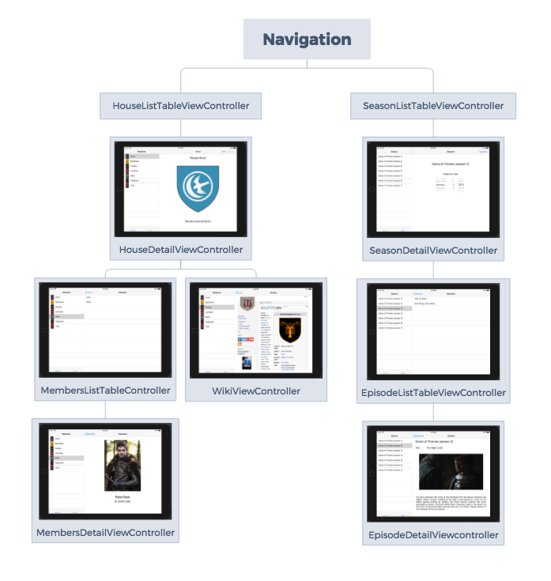

# Practica del modulo Fundamentos de IOS 

## Dispositivo

Implementado para IPad

## Vistas y Navegacion

La App tiene implementadas las sigientes view

|       nameViewController       |                     Descripcion                      |
| :----------------------------: | :--------------------------------------------------: |
|  HouseListTableViewController  |           Muestras una lista de las casas            |
|   HouseDetailViewController    | Muestra un detalle del nombre y la imagen de la casa |
|       WikiViewController       |          Muestras la pagina wiki de la casa          |
|   MembersListTableController   |   Muestra los miembros que se pusieron en la casa    |
|  MembersDetailViewController   |  Muestra un foto del personaje y su nombre y alias   |
| SeasonListTableViewController  |                Muestra las temporadas                |
|   SeasonDetailViewController   |      Muestra la temporada y la fecha de emisión      |
| EpisodeListTableViewController |    Muestra la lista de capitulos de una temporada    |
|  EpisodeDetailViewcontroller   |   Muestra un titulo con una imagen y un comentario   |

Que tienen la siguiente estructura:

## Test Unitarios

Como se pidió se ha realizado con la metodologia de **test unitarios**, se han realizado test para las siguientes clases.

- House
- Sigil
- Person
- Repository
- Season
- Episode

## Datos

Para la "adquisición" de datos se utiliza el fichero **Repository.swift** que a su vez llama al **DataFactory.swift**, esto es devido a que en un caso futuro se podria implementar en **Repository.swift** una logica para poder adquirir los datos de otro metodo.
